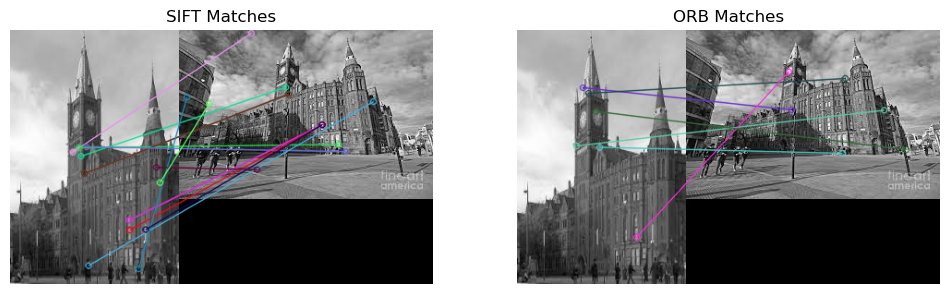

# Image Filtering & Feature Matching

Two computer-vision notebooks exploring local image filters and correspondence between photographs using OpenCV, NumPy, and Matplotlib.

[Image filtering](Assignment-task1COMP338.ipynb) · [Feature matching](Assignment-task2COMP338.ipynb) · [Assignment document](Assighment1-338%20-PDF%20file.pdf)

## What the notebooks explore

| Notebook | Focus | Saved visual output |
| --- | --- | --- |
| `Assignment-task1COMP338.ipynb` | Custom 3 × 3 filtering loops for edge detection, blur, sharpening, and embossing | Four original/filtered image comparisons |
| `Assignment-task2COMP338.ipynb` | ORB keypoint detection and SIFT/ORB descriptor matching with a ratio test | Keypoint visualizations and side-by-side match diagrams |

The filtering notebook makes the per-pixel operation explicit. The matching notebook moves from detecting distinctive points to drawing candidate correspondences between `victoria1.jpg` and `victoria2.jpg`. Its commentary also discusses SURF; SURF is not implemented here.

## View the existing results



*Original saved output from the matching notebook. These are exploratory matches, not verified ground-truth correspondences.*

Open the notebooks on GitHub to inspect their saved image outputs without executing them. The matching notebook records 14 accepted SIFT matches and 6 accepted ORB matches for its image pair and settings. These counts describe that saved run and are not a general performance comparison.

## Run locally

Install the notebook tools and the libraries imported by the source:

```bash
python -m pip install jupyter numpy matplotlib opencv-python
```

Place `victoria1.jpg` and `victoria2.jpg` beside the notebooks. **The original JPEG files are not included in this repository.** You can use your own image pair by updating the filenames in the cells, but the resulting figures and match counts will differ.

Open the notebooks with Jupyter and run all cells in order. Both now import their dependencies explicitly and use the tested helpers in `vision_utils.py`. Missing photographs produce a clear file error.

## Implementation and validation

- Custom convolution flips the kernel, applies zero padding, and retains signed floating-point responses. This fixes integer wrapping and computes border responses explicitly.
- Image resizing uses width correctly and preserves aspect ratios.
- SIFT descriptors use L2 distance; binary ORB descriptors use Hamming distance. Missing descriptors and fewer than two candidate neighbors yield no ratio-test matches.
- Historical outputs above were produced by the earlier coursework code. The notebooks' code outputs were cleared when their processing changed; they must be rerun with images to generate corresponding current results. The original discussion is labelled historical.

```sh
python -m pip install -r requirements-dev.txt
python -m pytest --rootdir=. tests
```

The tests use generated inputs to check signed convolution, border behavior, aspect ratios, descriptor distance selection, missing input, and featureless images. The original photographs were unavailable, so the historical comparison was not reproduced and no new SIFT-versus-ORB accuracy claim is made.

## Automated checks

GitHub Actions runs these generated-input tests with Python 3.11 and headless Matplotlib on pushes and pull requests. The workflow does not execute the notebooks or reproduce the historical photograph-matching result because the original JPEG inputs are unavailable.
